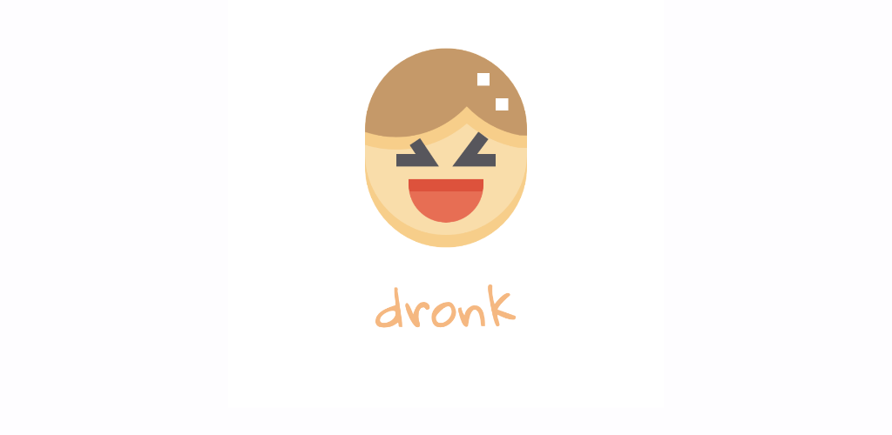
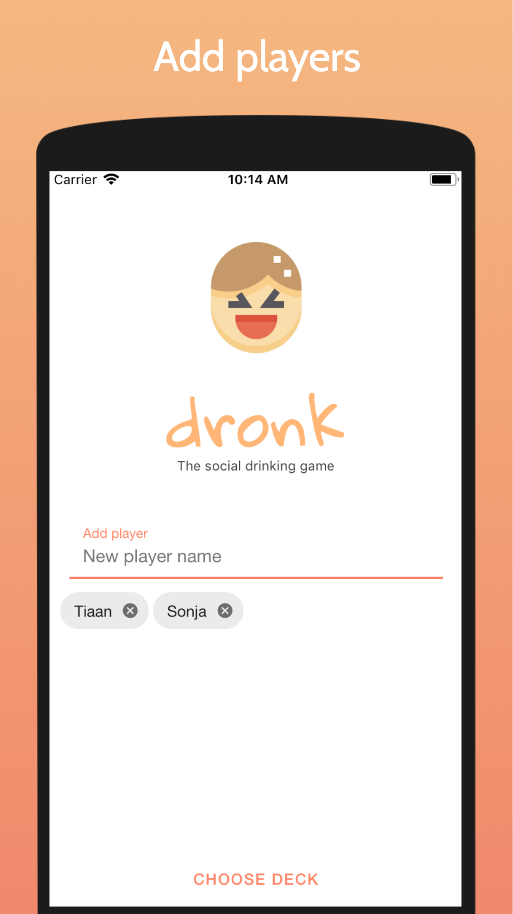
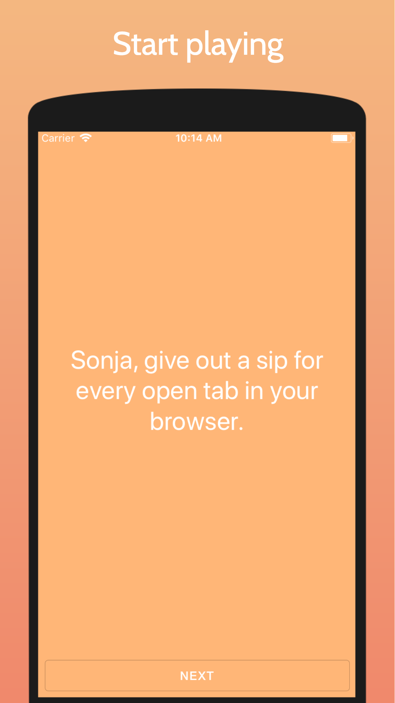

    

 

> The social drinking game

## Table of Contents

- [About](#about)
- [Contribute](#contribute)
- [Credits](#credits)
- [License](#License)

## About

Build for fun at [Init day](https://www.fullfacing.com/). Available on [Expo](https://expo.io/@tiaan/dronk).

    
    
    

## Contribute

1. Fork it and create your feature branch: git checkout -b my-new-feature
2. Commit your changes: git commit -am 'Add some feature'
3. Push to the branch: git push origin my-new-feature 
4. Submit a pull request

## Credits

Icons made by <a href="https://www.flaticon.com/authors/pixelmeetup" title="Pixelmeetup">Pixelmeetup</a> from <a href="https://www.flaticon.com/" title="Flaticon">www.flaticon.com</a> is licensed by <a href="http://creativecommons.org/licenses/by/3.0/" title="Creative Commons BY 3.0" target="_blank">CC 3.0 BY</a>

## License

MIT

    